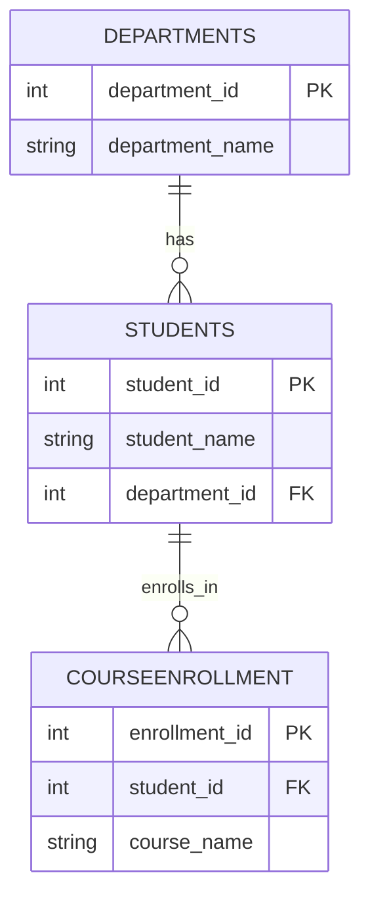

# What Database Systems Taught Me Beyond SQL: Reflections from a Semester of Learning 🎓🗄️

When I first enrolled in the Database Systems course, I expected to learn how databases store information and how SQL commands are used to interact with data. My initial understanding of the subject was quite limited. I thought databases were simply collections of static tables where information was stored for later use. Looking back now, after completing the semester, I realize how much broader and more meaningful the subject actually is.

Database Systems taught me far more than SQL commands, table creation, and query execution. It changed the way I think about information, organization, problem solving, and technology itself. The lessons I learned throughout the semester extended well beyond the classroom and provided valuable insights that will continue to benefit me throughout my Computer Engineering journey.

---

## The Initial Hurdle: Overcoming Terms and Definitions 📚

At the beginning of the semester, many concepts seemed unfamiliar. Terms such as tables, attributes, records, primary keys, foreign keys, and normalization appeared highly technical and complicated. Like many students encountering Database Systems for the first time, I focused heavily on understanding formal definitions and completing assignments.

However, as the course progressed, I began noticing a larger picture. Every topic was connected to a common objective: **managing information effectively**.

This realization helped me appreciate why databases play such a critical role in modern technology. Nearly every application that people use today depends on organized data. Whether it is social media, online banking, e-commerce platforms, healthcare systems, educational portals, or mobile applications, databases form the foundation that allows these systems to operate efficiently.

---

## Foundational Lessons: Structured Organization and Systems Thinking 🌐

One of the first lessons that stayed with me was the importance of organization. During my early database exercises, I sometimes viewed table design as a simple task. As I gained experience, I discovered that organizing information correctly requires careful planning and logical thinking. A poorly designed database may function initially, but it can create serious data anomalies as the system grows.

This lesson applies well beyond technology:
* **In Academics:** As a student, I daily manage assignments, deadlines, lecture notes, lab work, and examinations. The semester taught me that organized systems lead to better outcomes, whether managing data inside a database schema or managing responsibilities in daily life.
* **In Systems Engineering:** Another important lesson came from studying primary keys and foreign keys. Before learning these concepts, I viewed information as separate pieces of data. Database relationships showed me how different pieces of information connect with one another. Students belong to departments. Customers place orders. Patients visit hospitals. Every system contains relationships that must be managed carefully.

Understanding these relationships strengthened my ability to analyze problems from a broader perspective. Rather than focusing only on individual components, I started paying attention to how components interact within a complete system. This **systems-thinking approach** is valuable not only in databases but also in broader engineering and software development frameworks.

---

## From Theory to the Console: Hands-on Lab Milestones 🛠️

The Tech Gadgets database lab was a memorable milestone in my learning. Creating my own table, selecting attributes, choosing explicit data types, and inserting records transformed theoretical textbook concepts into practical knowledge. For the first time, I experienced the responsibility of designing a functional database structure myself.

Although the task appeared simple, it demonstrated how small design decisions influence the quality of an entire system. The experience reinforced the absolute importance of planning before implementation. This lesson reminded me of a pattern that appears repeatedly across engineering disciplines: *Successful projects depend on preparation and thoughtful design rather than rushing directly toward implementation.*

```sql
-- Enforcing structure: A design pattern built on planning before execution
SELECT student_name, department 
FROM Students 
WHERE student_id IN (
    SELECT student_id 
    FROM CourseEnrollment 
    WHERE course_name = 'Databases'
);
```

Writing this query was its own small milestone. It was the first time a nested query genuinely made sense to me — not because I memorized the syntax, but because I could picture exactly what was happening underneath it: the inner query first finding every student enrolled in "Databases," and the outer query then using that result to pull their names and departments. Once I could see that two-step logic in my head, subqueries stopped feeling like a syntax trick and started feeling like a natural way to ask a layered question.

Below is the relationship the lab was actually built on — a student connected to a department, and the same student connected to courses through enrollment:



Seeing it laid out this way made something click that the syntax alone never did: the query I wrote wasn't really asking SQL a question. It was walking along these connecting lines — from a course name, to an enrollment record, to a student, to that student's name and department. The diagram and the query were describing the exact same path, just in two different languages.

---

## Mistakes That Taught More Than Success 🔧

Not every lab session went smoothly, and I'm glad it didn't. I once forgot to define a foreign key constraint and didn't notice until I tried to insert an enrollment record for a student ID that didn't actually exist anywhere in the Students table. The database let me do it anyway. Nothing crashed. No error appeared. The data simply became unreliable, sitting there quietly, ready to cause confusion the moment someone tried to join it with real student records.

That mistake taught me something no lecture slide could have: a database doesn't protect you from bad data by default. You have to design that protection in, deliberately, before the bad data ever has a chance to arrive. It also reframed how I thought about errors in general. The error itself wasn't really the lesson. Noticing the absence of an error, and asking why the system should have stopped me and didn't, was the lesson.

I started carrying that habit into other parts of my coursework, too. Instead of only checking whether something worked, I began asking what *should* have gone wrong but quietly didn't.

---

## Beyond the Classroom: How This Changed My Thinking 🧠

By the middle of the semester, I noticed myself looking at ordinary apps differently. Opening a food delivery app, I no longer just saw a menu and a checkout button. I saw a Restaurants table, a Menu Items table tied to it, and an Orders table somewhere underneath, quietly linking a customer to a restaurant to a list of items. Database Systems didn't just teach me a subject — it gave me a new lens for looking at software I had been using my whole life without ever wondering how it actually held together.

This semester also reshaped how I approach problems outside of coding entirely:

* **Decomposition:** Just as a database breaks complex information into related tables instead of one giant unmanageable sheet, I learned to break large problems into smaller, connected, and manageable parts.
* **Consistency:** Database constraints exist to prevent contradictory or invalid data. I started applying the same standard to my own work — checking that my assumptions in one part of a project didn't quietly contradict what I'd written somewhere else.
* **Patience with complexity:** Concepts like normalization and relationships were confusing at first glance. Sitting with that confusion, instead of rushing past it, was often more valuable than getting the right answer quickly.

---

## My Advice to Future Students 🎯

If I could go back and give myself one piece of advice at the start of this semester, it would be this: don't treat Database Systems as a course about memorizing SQL syntax. Treat it as a course about *thinking clearly about information*. The syntax is the easy part — you can look up a `JOIN` clause in thirty seconds. Understanding why a relationship should exist in the first place is the part that actually takes a semester to learn.

I would also tell myself to lean into the mistakes rather than avoid them. Every constraint violation, every malformed query, and every messy table design taught me more than the labs that went perfectly on the first try.

---

## 📝 Reflection

Database Systems gave me something I didn't expect when I walked into the first lecture: a more disciplined way of thinking about information, structure, and consequences. SQL was the language, but the real subject was organization — how to take something messy and give it a shape that holds up under pressure.

Looking back across this entire semester, from my very first `CREATE TABLE` statement to debugging a missing foreign key constraint, I can see a clear thread connecting every post I've written. Each topic built on the one before it, and each mistake taught me something the textbook definition alone couldn't.

This is, first and foremost, a record of my own first-hand experience working through this course — not a tutorial or a guide written from the outside looking in. I'm sharing it because writing it down has helped me understand my own learning better, and because I hope it might resonate with another student somewhere at the very start of their own Database Systems journey.

#MLwithDrBilalAhmad #DrBilalAhmad #MLProject #DatabaseSystems #SQL #Reflection #StudentJourney #ComputerEngineering #SemesterRecap
